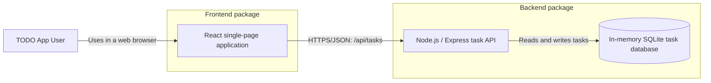
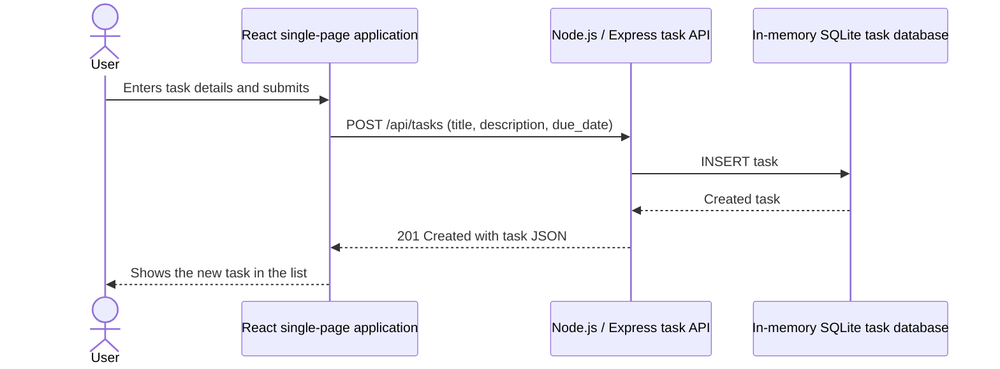

# Cloud Architecture Overview

This TODO application is an npm-workspaces monorepo with a React frontend and a Node.js/Express backend.

## Create a TODO

The frontend is responsible for the task-management experience. The backend exposes task CRUD, search, filtering, sorting, and completion-status operations through `/api/tasks`. The current SQLite database is in-memory, so task data is reset when the backend process restarts.